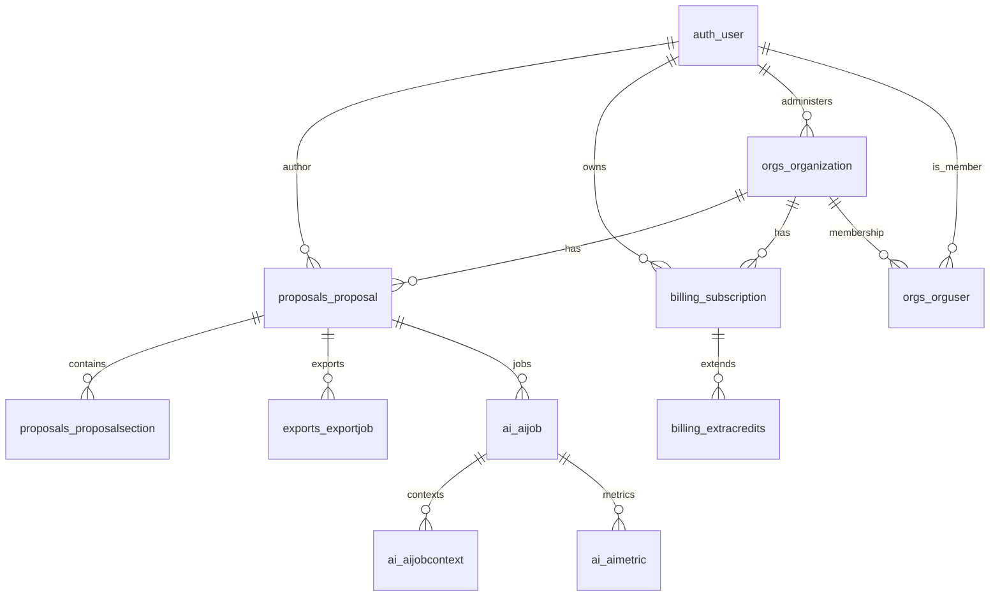

# Backend Proposal Flow & Quota System Audit (2025-09-09)

> Purpose: Canonical technical reference of current proposal creation/edit pipeline, AI section lifecycle, and quota enforcement logic to prevent duplication during upcoming alpha work (sections, planner, memory, safety, metrics). Keep this synchronized with implementation; supersedes ad-hoc notes in `Todo.md` for these domains.

## 1. High-Level Flow Overview

```text
User (UI) ──create proposal──▶ DRF Viewset (ProposalViewSet.create)
  │                               │ (permission: IsAuthenticated + CanCreateProposal)
  │                               ▼
  │                        Proposal row (state=draft, content={}, schema_version=v1)
  │                               │
  │ ── plan/write/revise section ─┼▶ AIJob (plan/write/revise) + AIJobContext + AIMetric
  │                               │          (retrieval → provider → validation → persist)
  │                               │
  │ <── updated draft/approved section via section pipeline helpers (save_write_result / apply_revision / promote_section)
  │
  └── archive / unarchive ───▶ ProposalViewSet.partial_update (state transitions + quota check on unarchive)
```

## 2. Data Model (Relevant Tables / Models)

### Proposal (`proposals.models.Proposal`)

Fields (current):
- author (FK auth user, CASCADE)
- org (FK `orgs.Organization`, PROTECT, non-null)
- state: `draft|final|archived`
- content: JSON (legacy aggregate content; currently a placeholder for structured sections to coexist)
- schema_version: string (default `v1`)
- shared_with: JSON list (future collaboration/sharing semantics)
- archived_at: datetime nullable
- created_at / last_edited / downloads (metrics style fields)

Notes:
- Active vs archived classification used for quota active cap checks.
- Un-archiving triggers `can_unarchive` (active cap only, not monthly cap).

### ProposalSection (`proposals.models.ProposalSection`)

Fields:
- proposal (FK → Proposal, CASCADE, `related_name=sections`)
- key (slug-like identifier; unique with proposal)
- title
- order (PositiveInt)
- approved_content / draft_content / content (legacy alias synced to approved_content)
- state: `draft|approved`
- revisions: JSON list (capped to last 50 entries; each revision item truncated; optional diff blocks (≤25) + change_ratio)
- metadata: JSON (extensible for future signals e.g., planner hints)
- locked: bool (used in SectionPromotionView & tasks to block concurrent writes after promotion)
- created_at / updated_at

Indexes / Constraints:
- unique_together (proposal, key)
- indexes on (proposal, key), (proposal, order), (proposal, state)

Lifecycle Helpers:
- `save()` keeps legacy `content` synced to `approved_content`.
- `append_revision()` handles safety truncation & diff block normalization.

### Billing / Quota Models
- `billing.models.Subscription`: seat counts, tier, status (active|trialing|past_due|...) used in tier resolution.
- `billing.models.ExtraCredits`: per month additive proposal allowances (field `proposals`).
- `orgs.models.OrgProposalAllocation`: enterprise monthly distribution logic.

### AI Models
- `ai.models.AIJob`: asynchronous unit of plan/write/revise/format work.
- `ai.models.AIJobContext`: captures prompt snapshot, snippet ids, retrieval metrics, redaction mapping.
- `ai.models.AIMetric`: per job timing/token success/failure instrumentation.

## 3. Creation & Editing Pipeline

### Creation (`ProposalViewSet.create`)
- Permissions: `IsAuthenticated` + `CanCreateProposal`.
- Org scoping via `X-Org-ID` header; membership validated through `OrgUser` existence.
- On success, proposal row inserted; quota usage increments implicitly by presence of new row.
- Middleware redundancy: `QuotaEnforcementMiddleware` additionally blocks over-quota POST /api/proposals (idempotent with permission class; potential duplication risk—see recommendations).

### Editing / Partial Update
- `partial_update` allows patching state/content fields (content JSON currently direct). Archiving sets `archived_at`; un-archive path executes `can_unarchive` (active cap only).
- State change from archived to active returns 402 with structured quota response headers if over cap.

### Section Lifecycle (AI)
- Write (`ai.tasks.run_write`): validates section not locked; retrieves snippets; provider `write` -> result draft stored via `save_write_result(section, draft_text)` (helper in `ai.section_pipeline`).
- Revise (`ai.tasks.run_revise`): ensures not locked; diff computed via `diff_texts`; result applied with `apply_revision(section, revised_text, promote=False)` then `section.append_revision(...)` logs revision with diff blocks & change_ratio.
- Promote (`SectionPromotionView.post`): permission check (ownership/membership), then `promote_section(section)` sets `locked=True` (implementation in `ai.section_pipeline`—ensures immutability of approved content path); AIMetric logged of type `promote`.
- Unlock (`SectionPromotionView.delete`): resets `locked=False` (rare path, possibly for admin override / user rollback; future governance may restrict).

### Formatting / Export
- `run_format` (AI): builds final formatted markdown (not section-specific; uses full text). Not quota impacting.
- Exports (in `exports` app) reference `Proposal` via FK; not quota impacting directly.

## 4. Quota Determination & Enforcement

### Tier & Subscription Resolution
- `get_subscription_for_scope(user, org)` chooses active/trialing subscription (org scope preferred; else user scope) -> returns `(tier, status)`.
- Past_due grace window configurable via `FAILED_PAYMENT_GRACE_DAYS` (defaults 3) retains tier benefits briefly.

### Limits per Tier (`get_limits_for_tier`)
- free: `active_cap=1`, `monthly_cap=None` (lifetime single active/draft total allowed; code additionally enforces a lifetime total of 1, not just active cap, via explicit count check).
- pro: `active_cap=None`, `monthly_cap=default 20` (dynamic per-seat override possible).
- enterprise: `active_cap=None`, `monthly_cap` from settings (may be large or None for unlimited).

### Dynamic Pro Cap
- `get_effective_pro_monthly_cap`: if subscription has seats > 0, `cap = seats * QUOTA_PRO_PER_SEAT + extras` (extras from `ExtraCredits` for month). Falls back to static `QUOTA_PRO_MONTHLY_CAP` when no seats.

### Enterprise Allocation
- `compute_enterprise_effective_cap(admin_user)`: splits `QUOTA_ENTERPRISE_MONTHLY_CAP` among orgs with per-org overrides using `OrgProposalAllocation`; zeros share remainder equally.

### Usage Accounting
- `get_usage(user, org)`: counts active (non-archived) and created_this_period (>= first day of month).

### Enforcement Points
1. Creation permission class (`CanCreateProposal.has_permission`): calls `check_can_create_proposal`; modifies error message with reason if denied.
2. Quota middleware: performs identical check for POST `/api/proposals` (returns JSON 402). (Duplication.)
3. Un-archive path: `can_unarchive` enforces `active_cap` only (not monthly) to permit retrieval of archived proposals without consuming monthly creation slot.

### Failure Responses
- On failure: 402 (Payment Required) + body `{error: "quota_exceeded", reason, tier, limits, usage}` and header `X-Quota-Reason`.
- Reasons: `active_cap_reached`, `monthly_cap_reached`.

### Lifetime Semantics (Free Tier)
- Explicit additional guard counts total proposals in scope; any existing ≥1 forbids creation (even if archived) ensuring deletion/archival does NOT restore ability to create another (true lifetime limit). This is stronger than mere active cap.

## 5. AI Revision & Diff Tracking
- Section revisions stored in `ProposalSection.revisions` (JSON list) with truncation to last 50.
- Diff engine `ai.diff_engine.diff_texts` yields `change_ratio` + block list (capped to 25 persisted blocks by `append_revision`).
- Draft vs approved separation supports pending revisions (draft_content) prior to promotion.

## 6. Current Duplication & Divergence Risks
| Area | Observed Duplication / Divergence | Impact | Recommendation |
|------|------------------------------------|--------|----------------|
| Quota Enforcement | Permission class + Middleware both block creation | Double maintenance; potential inconsistent messaging | Remove middleware or restrict to legacy clients; rely solely on DRF permission (preferred). |
| Section Data Source | Legacy `Proposal.content` vs new `ProposalSection` rows | Confusion in read paths; risk of stale sync | Define migration plan: read path should pivot to sections first; mark `content` deprecated; add adapter serializer sooner. |
| Revision Logging | AI tasks call `apply_revision` then `append_revision`; future Section model may add similar logic | Risk of second revision log mechanism | Centralize revision operation in a single service (e.g., `sections.revise(section, new_text, diff)`). |
| Promotion Lock | `locked` flag + `state` (`approved`) distinction | Two flags could drift | When promoting: set `state='approved'` and `locked=True`; enforce invariant in save() or dedicated promote function. |
| Quota Reason Messaging | Middleware 402 vs permission error message | Slight inconsistency for clients | Consolidate to one code path (permission). |
| Unarchive Active Cap | `can_unarchive` and creation both inspecting active cap separately | Duplicated logic albeit small | Optionally reuse a shared helper returning active cap feasibility. |
| Seat-based Cap + Extras | `get_effective_pro_monthly_cap` excludes extras addition for static fallback scenario | Slight under-count seats absent – extras applied only when seat-based path | Document intentionally; or unify logic to always add extras. |

## 7. Gaps vs Planned Alpha Assumptions
| Planned Assumption | Current State | Gap | Action |
|--------------------|--------------|-----|--------|
| Single-run planner structure stored | Planner produces plan JSON but not directly binding section creation | Need migration: instantiate initial `ProposalSection` rows from planner output | Implement plan→section materializer. |
| Per-section 5 revision cap | No hard cap; list truncated to last 50 | Missing enforcement of count ≤5 | Enforce in `append_revision` or higher-level revise service, returning 409 when exceeded. |
| Call URL immutable field | Not present on `Proposal` | Missing field & constraints | Add `call_url` CharField (indexed, nullable initially) + set once at creation; block updates when set. |
| Metrics: question_hash / structure_hash | Not implemented | Add hash computation at planning & store (Proposal fields or AIMetric context) | Extend AIJobContext or Proposal fields (`structure_hash`, `question_hash`). |
| Memory injection (top K usage_count) | Not implemented | Implement memory model/table or adapt existing snippet store | Define `AIMemory` model or extend existing resource model with usage counts. |
| Quota instrumentation tokens (log only) | Partial tokens in AIMetric per job; not aggregated per proposal | Need aggregated logging or scheduled roll-up | Add periodic task aggregating tokens per proposal/org for future pricing. |
| Safety / injection shield | Not present | Entire component missing | Implement pre-processor in AI endpoints before job creation. |

## 8. Suggested Implementation Order (to avoid rework)
1. Remove quota middleware (optional) → rely on `CanCreateProposal`. (Low-risk cleanup.)
2. Introduce `call_url` field & immutability check (ensures planner anchor). Add DB index.
3. Planner materialization: map plan output to ordered `ProposalSection` rows (idempotent if rows already exist).
4. Section read path refactor: serializer/endpoint returns sections collection; gradually deprecate `Proposal.content` for new flows.
5. Revision cap enforcement (5) centralized service; update AI tasks to call service instead of direct `apply_revision` & `append_revision` sequence.
6. Promotion invariant: ensure `state='approved'` + `locked=True`; unify unlocking semantics (maybe restricted).
7. Metrics enhancements: add structure/question hashes; log fallback_mode once planner fallback invoked.
8. Memory injection foundation (model + retrieval insertion) prior to safety shield (so shield can also inspect memory content if needed).
9. Safety / injection shield pre-flight component.
10. Consolidate quota reason messages & doc updates.

## 9. Potential Migrations
```sql
-- Add call_url field (nullable initially)
ALTER TABLE proposals_proposal ADD COLUMN call_url varchar(512);
CREATE INDEX proposals_proposal_call_url_idx ON proposals_proposal(call_url);
-- (Django migration will handle actual generation)
```
Follow-up: backfill existing proposals (derive from plan job input if available; else leave NULL). Enforce immutability at model `save` or serializer `update`.

## 10. Security & Integrity Considerations
- PROTECT on org FK prevents silent data orphaning; validate this aligns with deletion policies.
- Revision JSON growth controlled (≤50 entries; each truncated). Proposed cap shift (5) lowers storage risk further.
- Locking semantics rely on application-level `locked` boolean; not a DB constraint—race conditions minimal due to single-threaded write tasks, but consider optimistic check (WHERE locked=FALSE) in update for robustness.
- Quota enforcement race: two rapid create requests could pass permission before commit; consider DB-level unique partial index if strict global-lifetime enforcement is critical (free tier). Current risk acceptable for early alpha.

## 11. ER Diagram (Mermaid)


## 12. Open Questions

- Should archived proposals count against active cap for paid tiers (currently only free active cap concept)? An active cap is unnecessary, as we limit usage by proposal CREATION. Proposals, being simple text files, take up so little space in our storage that maintaining an active cap for paid tiers seems like an unnecessary restriction that could frustrate users.

- Do we allow unlocking after approval in production, or is that an admin-only escape hatch? (Currently public endpoint.) We allow editing proposals even after approval, yes, provided they have revisions left for the specific section they want to edit. If free plan users end up abusing this, we will restrict it to X edits in the future. Because proposals will still be locked to individual calls and that call's information will therefore inevitably be written into the final document (such as a proposal title stating which grant is being applied for), the potential for abuse is low.

- Where to surface revision count remaining (UI contract) — serializer vs separate endpoint? Once a user is shown a section in the proposal creation flow, it would make sense to have a counter above the text field showing: "Revisions remaining for this section:" 

- Memory model reuse: adapt AIResource snippets vs new table? (Affects ingestion complexity.) I don't know, make a rational determination. User experience is defining: User must be able to save a snippet after writing it, and recall it on similar questions in the future, unless they later decide to delete it again. Users should have a place to view all their snippets and uploaded files at a glance, but this can be deferred until post-alpha. 

## 13. Summary of Recommendations

1. De-duplicate quota enforcement (remove middleware or mark deprecated).
2. Add immutable `call_url` early; base future planner & question hashing on it.
3. Materialize sections from planner output and pivot read path to sections.
4. Centralize revision logic + enforce 5-cap with clear 409 error payload.
5. Harmonize promotion semantics (state + lock) and restrict unlock.
6. Extend metrics (structure_hash, question_hash, fallback_mode).
7. Implement safety shield before broad testing.
8. Build memory injection after section materialization but before safety (so shield can evaluate memory content if needed).
9. Document lifetime semantics explicitly (free tier) in public docs.

## 14. Appendix: Key Functions Reference
| Function | Location | Role |
|----------|----------|------|
| `check_can_create_proposal` | `billing/quota.py` | Enforce create (tier, monthly, lifetime) |
| `can_unarchive` | `billing/quota.py` | Active cap check only |
| `get_effective_pro_monthly_cap` | `billing/quota.py` | Seat + extras math |
| `ProposalViewSet.perform_create` | `proposals/views.py` | Persist new proposal w/ org scoping |
| `ProposalSection.append_revision` | `proposals/models.py` | Persist revision with diff truncation |
| `run_revise` | `ai/tasks.py` | Provider revise + diff + revision log |
| `run_write` | `ai/tasks.py` | Provider write + draft persistence |
| `promote_section` | `ai/section_pipeline.py` | Approve + lock section (implementation detail) |
| `QuotaEnforcementMiddleware` | `billing/middleware.py` | (Redundant) early POST guard |

---

Maintain this document alongside future migrations. When implementing each recommendation, update the relevant section (esp. Gaps table & ERD) to keep downstream docs accurate.
